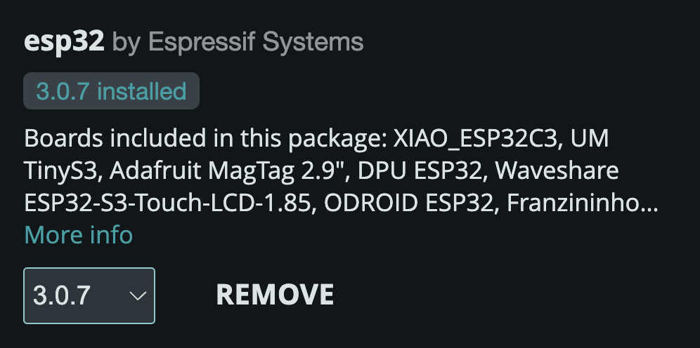
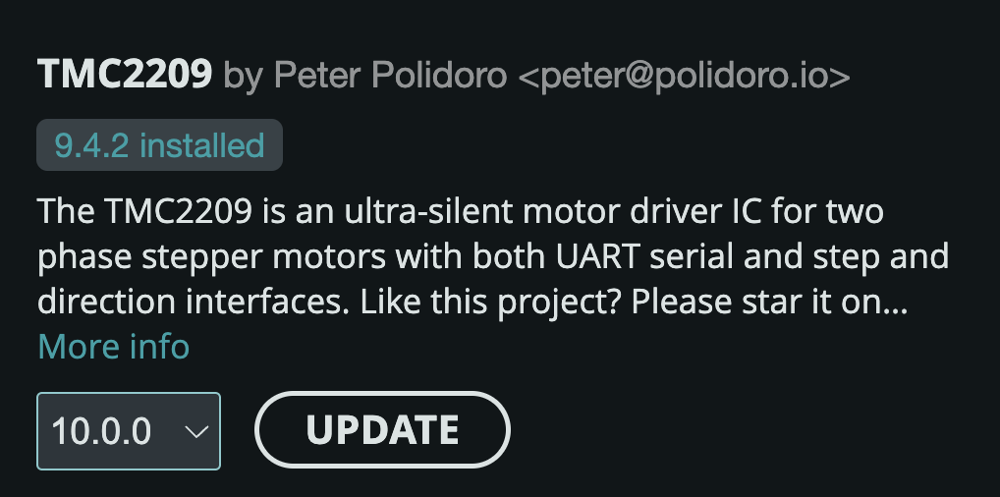
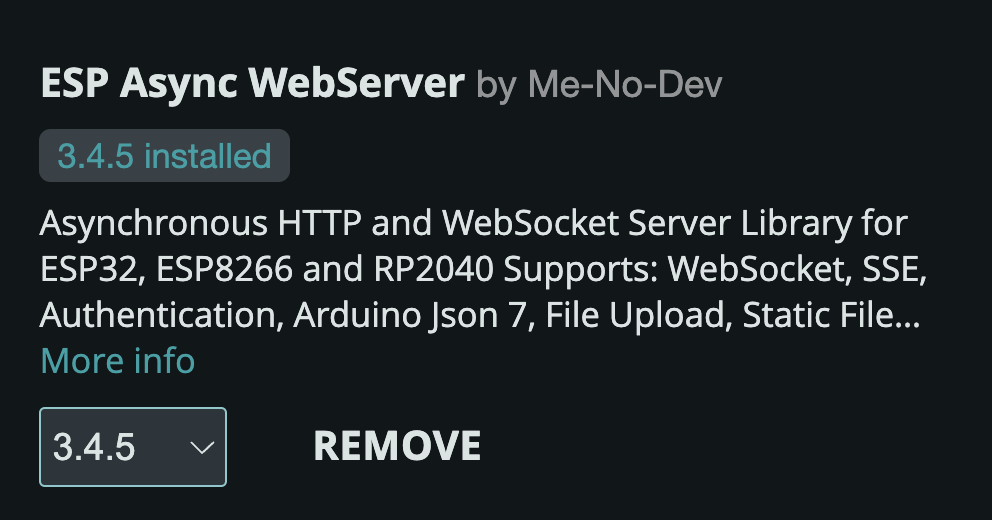
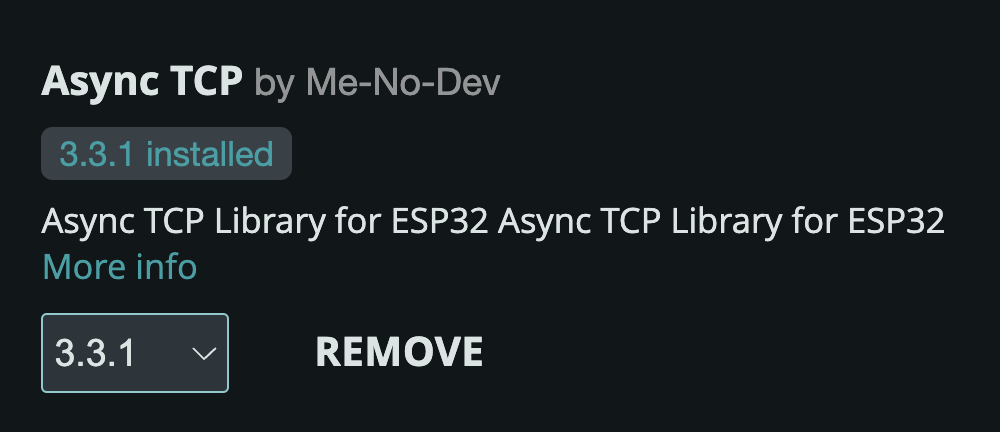
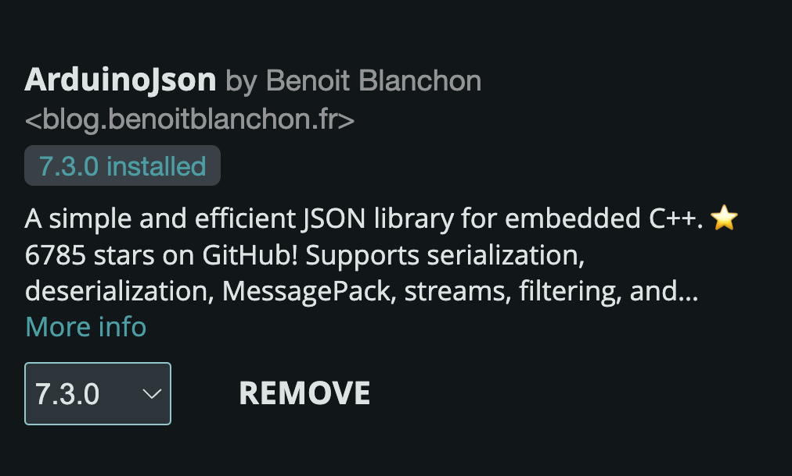

# PD-Stepper-Servo

Controller that helps integrate [PD Stepper](https://github.com/joshr120/PD-Stepper) into robotics projects. Currently supports REST API interface, soon to be integrated with ROS.

## Install IDE

The simplest way to build and upload controller code to ESP32S3 Dev Kit on PD Stepper board is by using the Arduino IDE.

Download and install the [Arduino IDE 2.x](https://www.arduino.cc/en/software) for your platform from Arduino website.

## Install Board

Install Expressif support files for ESP32 in Arduino IDE:

  * Select `Tools` -> `Board` -> `Boards Manager...`
  * Search for `esp32`
  * Install `esp32` package by Expressif Systems
  
    > Mac: install [Expressif firmware driver](https://github.com/WCHSoftGroup/ch34xser_macos)
    > Linux: see available [Expressis firmware driver options](https://github.com/WCHSoftGroup)

## Install Libraries

* Install `TMC2209` library by Peter Poliodoro:
  
* Install `ESP Async WebServer` library by Me-No-Dev:
  
* Install `Async TCP` library by Me-No-Dev:
  
* Install `ArduinoJson` library by Benoit Blanchon:
  

## Select Board

Select the board for uploading in Arduino IDE:

* Select `Tools` -> `Board` -> `esp32` -> `ESP32 S3 Dev Module`

## Select Port

Select the port for uploading in Arduino IDE:

* Select `Tools` -> `Port` -> `/dev/cu.usbmodem2101 (ESP32 Family Device)`

## Upload

Open [PD-Stepper-Servo.ino](./PD-Stepper-Servo/PD-Stepper-Servo.ino) in Arduino IDE to prepare for upload.

There are two ways to upload code to ESP32 S3 Dev Kit:

* **Automatic**: works just like uploading code to Arduino, but you lose the ability to use Serial Monitor and Serial Plotter in Arduino IDE. If you are not debugging by logging messages to Serial port, this method is preferred.
* **Manual**: requires you to momentarily hold *Boot* button on PD Stepper board, press *Reset* button, and then let both buttons up. This puts ESP32 into upload mode, which lets you upload with *USB CDC on Boot* option *enabled* and use Serial Monitor and Serial Plotter.

### Automatic

* Select `Tools` -> `USB CDC On Boot` -> `Disabled` (only done once)
* Click Upload in Arduino IDE:

  

> Serial Monitor and Serial Plotter cannot be used in this mode.

### Manual

* Select `Tools` -> `USB CDC On Boot` -> `Enabled` (only done once)
* Hold `Boot` button on PD Stepper board, press `Reset` button, then let go of both buttons
* The `3V3` LED on PD Stepper Board should go off, showing that ESP32 is accepting only Upload commands and not running code
* Click Upload in Arduino IDE:

  

> Serial Monitor and Serial Plotter can now be used to view output written to Serial port.

### Troubleshooting

Uploads to ESP32S3 Dev Kit often fail even after installing the firmware.

Whether you chose *Automatic* or *Manual* upload mode, the upload is equally as likely to fail.

If the upload fails more than twice in a row, try re-opening Arduino IDE and unplugging/re-plugging PD Stepper.

It is possible for the upload to fail more than 5 times in a row but then succeed - patience and maintaining a calm composure is important.

## Interface

PD Stepper Servo supports REST API and Micro ROS interfaces.

### REST API

The PD Stepper REST API interface is configured with this statement in `PD-Stepper-Servo.ino`:

```
  initRestInterface(
    "NETWORK",
    "PASSWORD",
    8080,
    ...
  );
```

Replace `NETWORK` with your wireless network name, `PASSWORD` with your network password.

PD Stepper Servo will automatically join the specified network and start a server on port `8080`, unless you specify a different port.

Once joined, the IP Address will be printed to serial port.

When the address is known, you can import [PD Stepper PostMan Collection](./PD-Stepper.postman_collection.json) into PostMan and call the endpoints to get status, configure, settings, and send position or velocity commands.

### ROS API

The MicroROS API for ROS2 will be implemented next.
